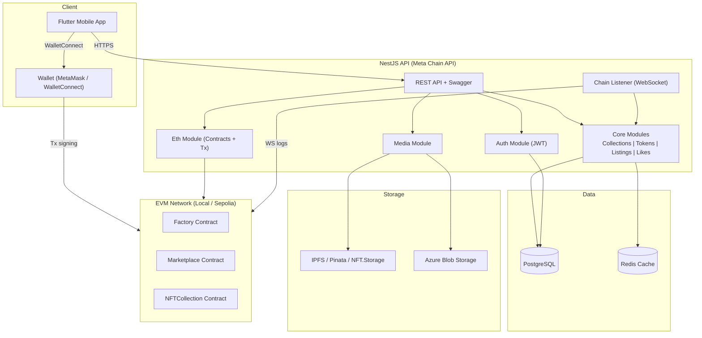
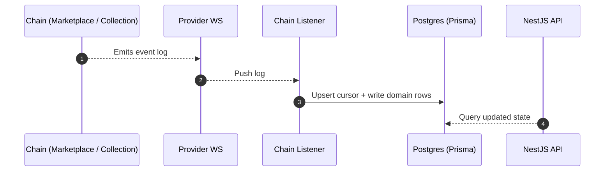

# System Architecture (Mermaid)

This document provides a code-based system architecture view for the Meta Chain API and the Flutter client. The diagram is written in Mermaid so it can live alongside the code and be updated with the system.

## System Context

## On-chain Event Ingestion

## Notes

- The Flutter client talks to the NestJS API for off-chain data, and uses a wallet for on-chain transactions.
- The chain listener replays missed events and maintains a cursor for idempotent processing.
- Storage services are optional; choose IPFS or Azure based on the media flow you enable.
